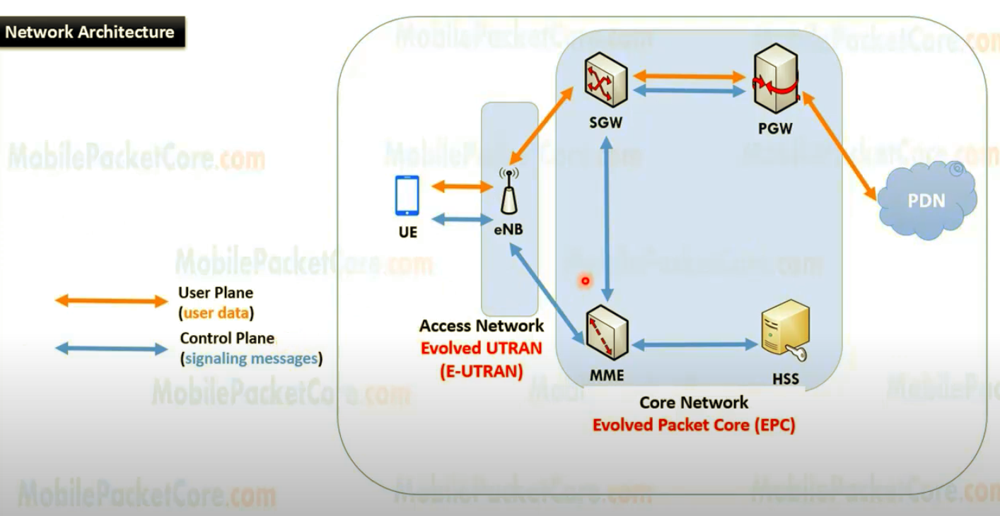
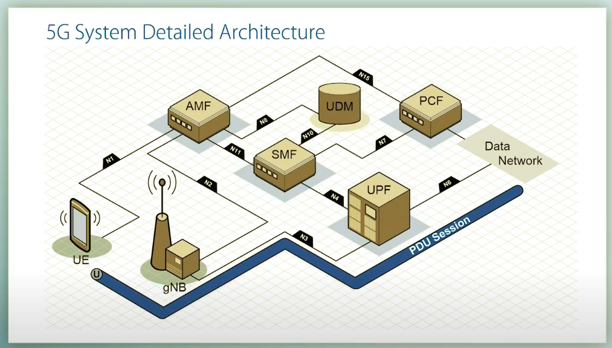

# Intro
Last Updated 16:15, 27-05-2022 \
The Following is My notes on 4G & 5G Networks based on [This Discussion](../minutes/001.md). The notes are a bit chaotic right now due to raw dumping of information and will get sorted out within a day or two.

# Terms

## 4G
- **MME**: _Mobility Management Entity_: It is used for Paging ,Authentication, Handover and Selection of Serving Gateway

- **SGW**: _Serving gateway_: It is used to Routing and Forwarding user data packet.
- **PDN-GW**: _Packet Data Network Gateway_: It is used for user equipment (UE) IP allocation
- **HSS**: _Home Subscriber Server_: It is a user Database used for service subscriber, user identification and addressing
- **PCRF**: _Policy and Charging Rule Function_: It provide quality of service and charging
- **eNode B**: _evolved Node B_: It is used as radio resources management and radio bearer control

## 5G
- **eMBB**: _enhanced Mobile Broadband_
- **URLLC**: _Ultra Reliable Low Latency Communications_
- **mMTC**: _massive Machine Type Communications_

> Note PDU Sesh may not always be IP based it can be unstructured or Ethernet also
- **AMF**: _Access Mobility Func_: Similar to 4G MME. Temp ID also provided
- **SMF**: _Session Mgmt Func_: Done also by 4G MME. Routinely talks to PCF for Auth. Establishment of PDU Sesh. Chooses appropriate UPF while doing so, like say if conn is IP based, allocates an IP Address.
- **PCF**: _Policy Control Func_: Is Dynamic. Before for instance a PDU sesh is opened the SMF will check in with PCF before hand for say ex region specific funcs.
- **UPF**: _User Plane Func_: Anchor for gNBs, same across all changes. Implements Policy and enforces Quality of Service.
- **UDM** - _Unified Data Mgmt_: Similar to 4G HSS. Holds subscriber info i.e ZTA DB Funcs.
> Note all these processes are Virtualized Network Funcs which can run on Off-The-Shelf Arch therefore saving cost and making system more capable of scaling up and down.
>
> Such system also allows for Network Slicing by design as it can create logical networks on same physical infra.

# 4G Network Arch

Data Rate: 4G will range from 20 to 100 Mbps.

### Process
> Connection: Arrows i.e &rarr;, &larr;, <&rarr;||=.. Bolded are User Plane, rest are control plane/both
-  **UE &rarr; eNB** • eNB Provides Radio Interface to UE
- eNB &rarr; MME • MME Does Auth & Tracks Location
- - MME &rarr; HSS • HSS Gives Sub info of /allUsers
- - **MME &rarr; SGW** • SGW is instructed to form Tunnel w/ User
- SGW = UE • SGW facilitates data transfer and eNB transfer
- **SGW &rarr; PGW = PDN** • PDN is external network

## Built On/Supports
- IPv6
- GSM (2G Standard)
- MIMO: CDMA, OFDM i.e **≡>-<≡**
- IMT2000 (3G Standard)
- WLAN
- Software Defined Radio
- Ad Hoc & Multi Hop Networks
- VoIP - Avoid 2 protocols on same circuit

> **SideNote**
> - IPv6 simplified the router’s task compared to IPv4
> - IPv6 is more compatible to mobile networks than IPv4
> - IPv6 allows for bigger payloads than what is allowed in IPv4

## Advantages:
It provides better spectral efficiency.
It has high speed, high capacity and low cost per bit

# 5G Network Arch

 \
*PDU Sessions are Unique to Devices, Eash PDU may have multiple QoS Flow Sessions*

# Use Cases

Default Citation: https://youtu.be/_n9dNf-l36s

## Sensor Suites
We can employ a suite of sensor in any given factory which can warn maintainer of any potential errors before they happen. Say a turbine may have a vibration sensor which will warn before it goes out of permitted range.

## Maintenance Bots
- When power demand increases or decreases, 5G will enable CV2X to enable vehicle suites to automatically be deployed with say extra coal.
- When There are large collapses in plants where inspection is needed we can use 5G bots which then go to site and inspect it in place of humans like say in Fukishima which was both a radioactive and toxic env. \
    https://www.youtube.com/watch?v=f7qsfky4TmE
- Digital Twins can be used to navigate robots in confined spaces for maintenance which can then be performed without human intervention and even service stoppage. 5G enables for cm level tollerance levels as opposed to 4G in m. \
    NASA ISS uses Canada Arm
- There can be patrol bots in remote locations on mountains to inspect periodical ly to reduce manpower in hazardous areas \
    https://youtu.be/PkW9wx7Kbws @Austria in Illwerke Vkw plant by Energy Robotics
- We can use any such moving bots with Mix Reality Headsets to see env in realtime provided by ms latency due to 5G.

## Specific Advantages
- Oil Rigs can be converted to fully unmanned stations by automated monitoring and and using transport pipes/ships for support all powered by 5G network. This would Essentially save almost 1000 people per year and increase efficiency beyond human abilities due to realtime analytics data.
- Similar strategies can be used for Grid monitoring. [Paper](https://www.frontiersin.org/articles/10.3389/frcmn.2021.689590/full). [Arch](https://www.ericsson.com/en/reports-and-papers/industrylab/reports/bringing-5g-to-power)

## Potential Areas where I have no new ideas
- Mobile App
- Customer Service
- - Hotline Operation

# Magma
