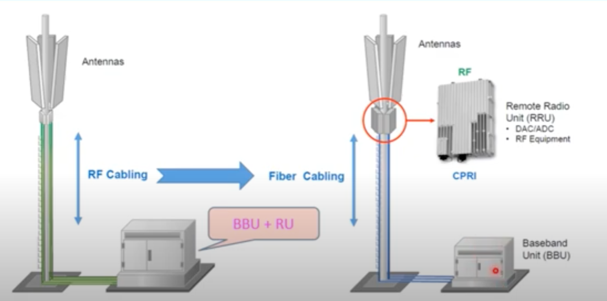
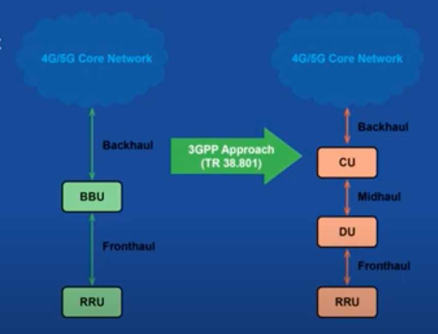
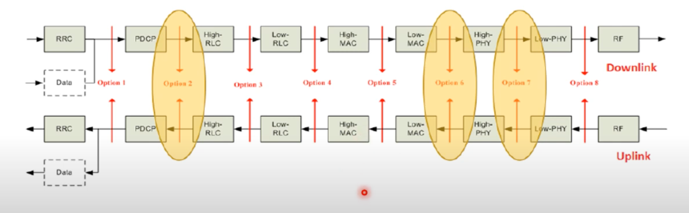
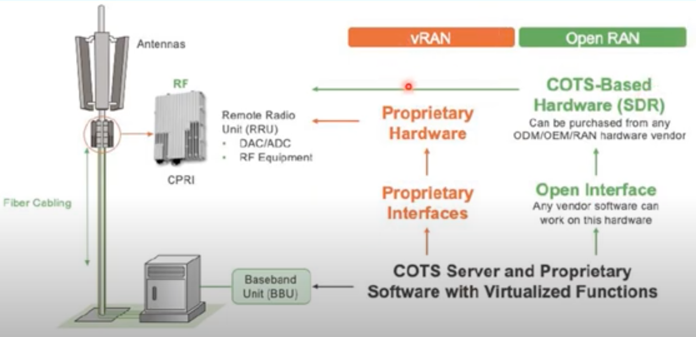
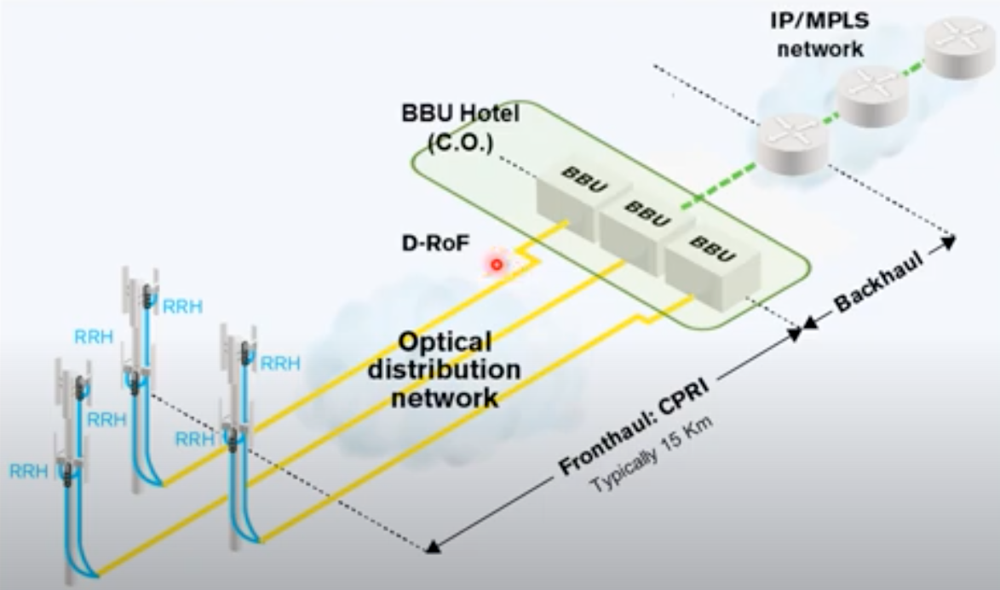
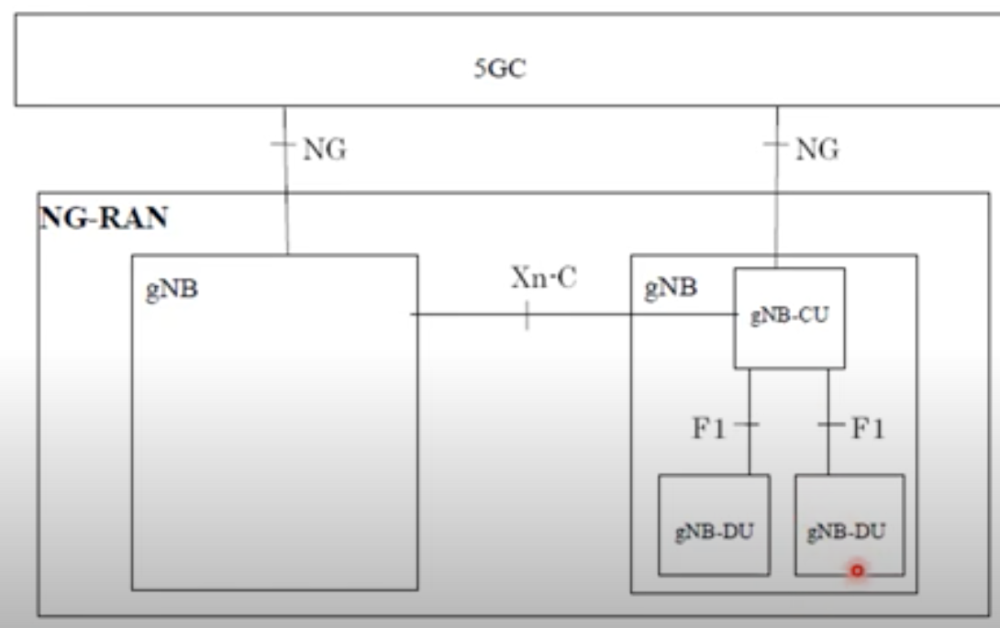

# Study of OpenRAN

## Implimentations to Look at

- CPRI (S) is usually proprietary
- RRU (H) & BBU (H & S) is proprietary

## Types/Evolution of RAN

### 2G
Antennas &larr; RF Cable &rarr; (BaseBandU + RadioU)
- There are Losses of about 2 dB due to RF cable length

### 3G
(Antennas + RRU) &larr; Fiber Cable &rarr; BBU
- RRU has been moved up from base to Antenna
- RF &rarr; Fiber
- Fiber now has no losses & is on CPRI Protocol

### vRAN
Same as 3G but BBU is COTS Hardware instead of proprietary. BBU is split into CU & DU with introduction of MidHaul.

As per 3GPP the following is the split between DU & CU

### Open RAN
Same as vRAN but RF is GPP COTS Hardware instead of proprietary. This also makes the interface between RRU & BBU different as it goes from proprietary CPRI to Open Interface

**OpenRAN Advantages**
- RRU can be of multiple types and from multiple vendors
- BBU can be from an even more different vendor

**Why OpenRAN?**
# &larr;-PENDING-&rarr;

## CRAN
CloudRAN. In DRAN (Distributed RAN) all BBU is located on site of tower and needs its own infrastructure everywhere. In case of CRAN, all BBU are taken to a Centralized location where calls & messages will be processed, this central location is called BBU Hotel.

RRU &rarr; Hotel (FrontHaul) is usually Fiber on CPRI for upto 15-20 km. Making a single location for BBU also allows it to be hosted on COTS server and virtualize it on cloud/edge.

CRAN ADVANTAGES
- Reduces Cost of Space, Heating/Cooling, Power, Test Access

## 5G RAN

5G gNB can be integrated or split into DU & CU parts as shown above. The Xn & F1 Interfaces are both open.

## Sources
- Parallel Wireless
- - https://youtu.be/b8UiIdwTCYI
- 5G Mobile Wireless@Youtube
- - https://youtu.be/yzm0K_PJxBg
- - https://youtu.be/-fVHO_WCGF8
- - https://youtu.be/SpWEfQ1PFPA
