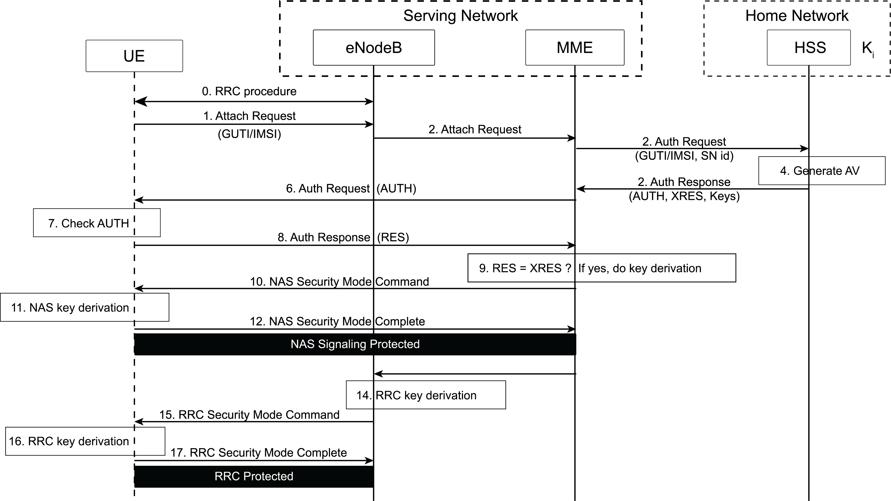

Ref: https://www.gsma.com/security/securing-the-5g-era/

## Auth Methods
- **4G**: EPS-AKA
- **5G**: 5G-AKA, EAP-AKA’, and EAP-TLS

There are two weaknesses in 4G EPS-AKA.

1. UE Id is sent over radio networks **without encryption**. A temporary identifier (e.g., Globally Unique Temporary Id, GUTI) may be used to hide a subscriber’s long-term Id, the GUTI allocation is flawed:
    - GUTIs are not changed as frequently as necessary
    - GUTI allocation is predictable (e.g with fixed bytes). More importantly, the UE’s permanent Id may be sent in clear text in an Id Response message when responding to an Id Request message from a network.
2. A home network provides AVs when consulted by a serving network during UE authentication, but it is not a part of the authentication decision. Such a decision is made solely by the serving network.

## How 5G is different
- The UE always uses the public key of the home network to encrypt the UE permanent Id before it is sent to a 5G network. In 4G, the UE always sends its permanent identifier in clear text to the network, allowing it to be stolen by either a malicious network (e.g., a faked base station) or a passive adversary over the radio links (if communication over radio links is not protected).
- The home network (e.g., the AUSF) makes the final decision on UE authentication in 5G. In addition, results of UE authentication are also sent to UDM to be logged. In 4G, a home network is consulted during authentication only to generate authentication vectors; it does not make decisions on the authentication results.
- Key hierarchy is longer in 5G than in 4G because 5G introduces two intermediate keys, KAUSF and KAMF (see Figure 5). Note: KSEAF is the anchor key in 5G, equivalent to KASME in 4G.