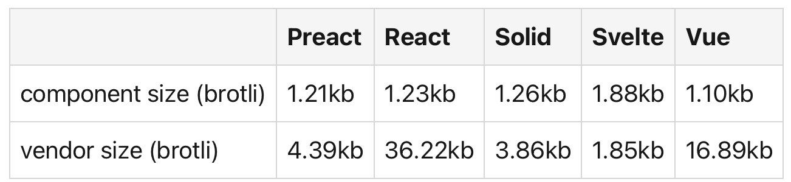

# Optimum Selection of Tech Stack and Improving Performance

We will set 3 core premises of decision making

> 1. EXTREME prejudice for performance and safety. An application can offer less features, but cannot be unsafe under any circumstances
> 2. OPTIMIZATION, We optimise not only for client but also service provider i.e in our case Wavelabs or any generic company in case of OSS
> 3. EXCELLENCE, We spare no efforts in making sure we give the fastest possible code with highest possible safety and least possible memory consumption to the client

## Requirements
- Backend
- Frontend
- Database
- Runtime

## Changes Recommended
> **Electron &rarr; Tauri**

Electron has been around for a very long time and is industry standard for 0 effort applications. Electron however by design is fundamentally flawed on 2 levels
1. **Runtime**: Electron is V8 in a C-family wrapper. This effectively means each instance of application deploys all of google chrome for EVERY SINGLE INSTANCE, this has a few disadvantages
    - It has a MASSIVE memory footprint

As can be clearly seen Tauri has 1/10th the memory consumption both physical and virtual of electron and about half the launch time required. \
<cite>Benchmark Measured Against real-world application simulator at @Fournux/tauri-vs-electron</cite>
\
\
Electron consumes massive amount of memory even in headless mode since even there it is still running a full browser just not its renderer. Tauri does not: since it is basically just a byte compiled Rust application.
    - It Needs a runtime in the first place for its backend. Electron's backend is written in C-family to run Javascript code which is a garbage collected language and therefore needs a runtime. This point goes back to the previous one

2. **Application**: Flaws at an application level
    - Electron is well known to have several vulnerabilities which due to its choice of language are inevitable. Very recently microsoft teams itself had a token Mining vulnerability which was disclosed.
    - It uses a 3rd party proprietary rendering engine which is prone to the flaws of its creating company. Tauri which uses webview not only generates a smaller bundle but it is also open source and therefore will be much more secured

### Benefits
- Application Host Size goes down by 90%
- Application is much lighter, faster and secure
- Application has SIMD and MIMD by default

> **React &rarr; Preact/Solid/Svelte**

React is well known for being memory inefficient.

It would be easiest for company to move from React to Solid or Preact as that would be 0 effort migration due to sharing of syntax and still a 90% cut in bundle size

If even last mile optimisation is needed the application can be rewritten in Svelte. However this should be done only if there are plans to scale the application later as Svelte scales up superlinearly compared to JSX based languages because of its design

### Benefits
- 90% Reduction in App bundle size
- Runtime Application Speedup

> **CSV &rarr; PostgreSQL**

### Benefits
- Data Manipulation, Transactions, Multiple Joins, Concurrent Access
- Indexing for 1,000,000x speed up in search

### Loss
Appending to CSV is instantaneous. Adding new user will be slow, searching from old users in SQL will be faster

> Backend: No change recommended

Cost to company will be too high medium term. And will ad no company short term. Changing backend will have any benefit if at all in extremely long term